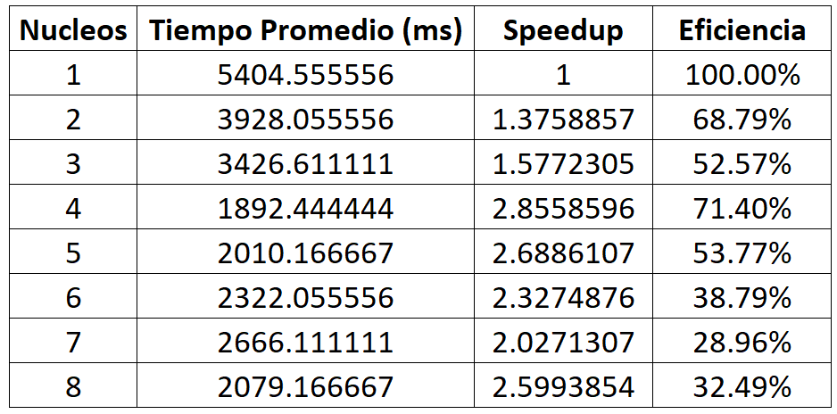
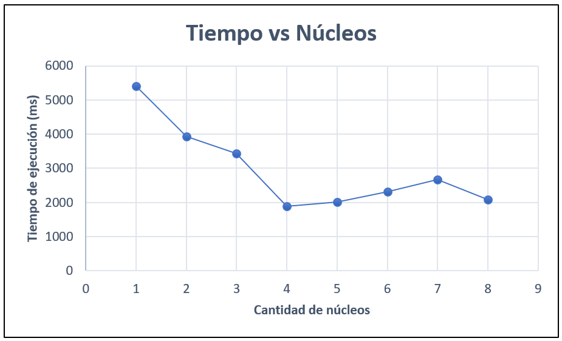
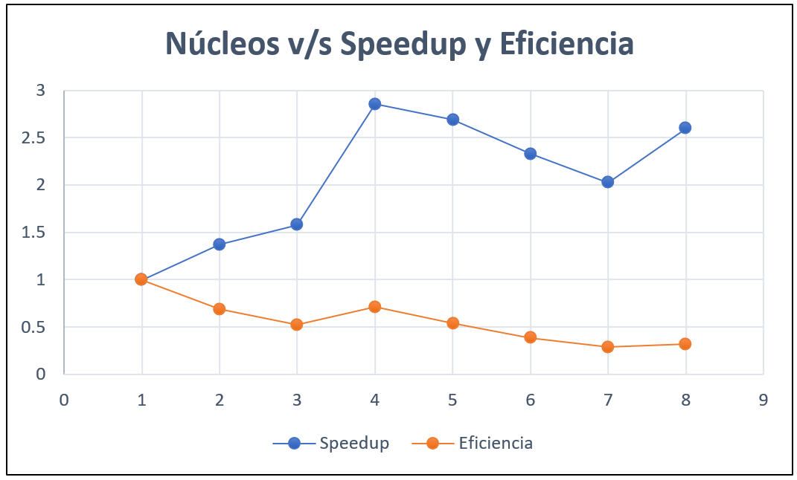

# Parallel Prime Numbers
- **Asignatura**: High Performance Computing
- **Semestre**: 2do Semestre, 2021
- **Carrera** : Ingeniería Civil en Computación e Informática
- **Universidad** : Universidad Catolica del Norte, Antofagasta
- **Profesor** : Diego Urrutia <durrutia@ucn.cl>
- **Estudiante**: Fabián Rojas

Este proyecto busca analizar el rendimiento en un algoritmo que nos
permite buscar cuántos números primos hay entre dos números.

El programa entrega los tiempos de ejecución que demora el algoritmo 
en encontrar dichos números primos, para esto se hace uso de programación
paralela.

El programa ejecuta el algoritmo con distintas cantidades de hilos, 
 comenzando con un hilo hasta el doble de los núcleos disponibles en el
computador donde se ejecuta el código.

Cada ejecución por hilo se ejecuta 20 veces para intentar llegar a un 
resultado de tiempo coherente.

##Resultados
A continuación, se muestran los resultados obtenidos durante una prueba.
Es importante tener en cuenta el hardware correspondiente al computador
donde se lleva a cabo la prueba, pues se obtendran distintos resultados
considerando principalmente la velocidad del procesador y cantidad de núcleos.
También, depende de los recursos disponibles del computador a la hora de 
tomar la prueba.

La siguiente prueba se llevó a cabo en un computador con las siguientes
características:

- **Procesador:** Intel(R) Core(TM) i7-6500U CPU @ 2.50GHz
- **Memoria RAM:** 16GB
- **Cantidad de núcleos:** 2
- **Cantidad de núcleos lógicos:** 4

Los datos resultantes fueron analizados en un excel, entregando la siguiente
tabla

Las medidas de rendimiento mostradas son las siguientes:

- **Speedup:** Tiempo necesario para procesar el algoritmo secuencialmente, o
  sea con un hilo, dividido por el tiempo necesario para procesarlo con "n"
  núcleos.
- **Eficiencia:** Speedup dividido por el número de núcleos.

Las condiciones ideales para estas medidas son:

- Speedup tiende a "n"
- Eficiencia tiende a 1 (o 100%)

Si analizamos los núcleos versus el tiempo tenemos el siguiente gráfico

Podemos ver que existe una tendencia significativa al decrecimiento de 
tiempo usando el paralelismo. Aunque desde los cuatro núcleos en adelante
el tiempo empieza a aumentar. Para ver de mejor manera estos resultados
se hace uso de las medidas de rendimiento.

Ahora bien, si analizamos la cantidad de núcleos versus el speedup y la
eficiencia, tendremos el siguiente gráfico

Del speedup deberíamos obtener una línea recta creciente con pendiente 
de uno en condiciones ideales, sin embargo, en el gráfico se tiene poca
linealidad, y desde el hilo 4 en adelante esta es decreciente, para luego
crecer en el hilo 8.

Por parte de la eficiencia, vemos que se va perdiendo a medida que se 
aumentan los hilos, este es un comportamiento esperable, pero en el hilo
7 se aleja mucho del valor ideal 1.

Podemos concluir que si bien el algoritmo permite alcanzar tiempos más 
bajos de ejecución, no es posible usar el algoritmo para High Performance
Computing, ya que esta disciplina exige que el algoritmo mantenga una
eficiencia estable cercana a 1 o 100%.

Por otra parte, se puede observar que con 4 hilos se obtienen las mejores
condiciones en términos de paralelismo, esto coincide con la
cantidad de núcleos lógicos del computador de prueba, por lo que en este
caso, lo más recomendable sería usar 4 hilos. 

